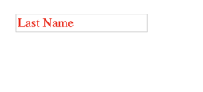

## [Переменные](../src/assets/scss/utils/vars.scss)

```scss
// Основной шрифт
$mainFont                : 'Montserrat', Helvetica, Arial, sans-serif;

// Размер и цвет основного шрифта
$mainFontColor           : #101010;
$mainFontSize            : 18px;
$mainFontWeight          : 400;
$mainLineHeight          : 1.4;

// Брекпоинты
$desktopWidth            : 1280px;
$smDesktopWidth          : 980px;
$tableWidth              : 768px;
$phoneWidth              : 480px;
$smPhoneWidth            : 320px;

// Основные цвета
$default-color           : #ffffff;
$primary-color           : #444ce0;
$success-color           : #26de81;
$danger-color            : #fc5c65;
$warning-color           : #fed330;
$light-color             : #999999;
$purple-color            : #8854d0;

// Нейтральные цвета
$neutral-primary         : #303133;
$neutral-regular         : #606266;
$neutral-secondary       : #909399;
$neutral-placeholder     : #C0C4CC;

// Цвета бордеров
$border-base             : #DCDFE6;
$border-light            : #E4E7ED;
$border-lighter          : #EBEEF5;
$border-lightex          : #F2F6FC;
```


## [Миксины](../src/assets/scss/utils/mixins.scss)

### Функция преобразует px в rem
[Статья](https://habr.com/ru/post/280125/) на тему что такое rem и em.


```scss
@function rem($pixels, $context: $mainFontSize) {
  @if (unitless($pixels)) {
    $pixels: $pixels * 1px;
  }

  @if (unitless($context)) {
    $context: $context * 1px;
  }

  @return $pixels / $context * 1rem;
}
```
Испльзование

```scss
// scss
h2 { font-size: rem(12px);}

// css
h2{font-size:.6666666667rem}
```

### Миксин для стилизации placeholder

```scss
@mixin placeholder {
  ::-webkit-input-placeholder {@content}
  :-moz-placeholder           {@content}
  ::-moz-placeholder          {@content}
  :-ms-input-placeholder      {@content}
}
```
Использование

```scss
// scss:
input {
  @include placeholder {
    color: red;
  }
}

//css:
input::-webkit-input-placeholder {
  color: red;
}
input:-moz-placeholder,
input::-moz-placeholder {
  color: red;
}
input:-ms-input-placeholder {
  color: red;
}
```


### Медиа запрос

```scss
@mixin max-width($max-width) {
  @media (max-width: $max-width) {
    @content;
  }
}
```
Использование

```scss
// scss
.block {
  background: green;
  @include max-width($desktopWidth) {
    background: red;
  }
}

// css
.block {
  background: green;
}
@media (max-width: 1280px) {
  .block {
    background: red;
  }
}
```
Модуль [css-mqpacker](https://www.npmjs.com/package/css-mqpacker) все запросы объеденит по брекпоинтам