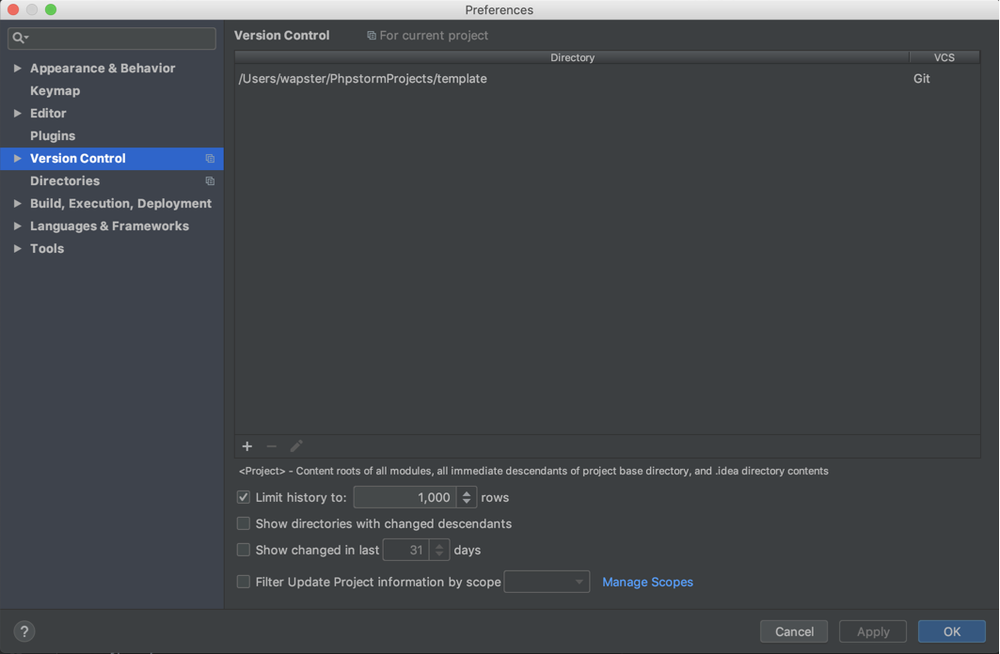

# Сборка Webpack c PUG

##Установка
**Должны быть установлены [node js](https://nodejs.org/en/) и [yarn](https://yarnpkg.com/en/docs/install)**

```
git clone git@github.com:wapster92/template.git .
yarn install
```

Если используете IDE (на примере phpStorm):

```
git init
git remote add origin git@github.com:wapster92/template.git
git fetch
git pull origin master
rm -rf .git
```

**rm -rf .git** команда bash удаляет скрытую папку .git для того чтобы отвязать проект от репозитория. Если вы пользователь Window удалите в ручную из проводника. Затем обязательно нужно удалить инициализированный Git из настроек редактора по пути:



```
yarn install
```
## Запуск

```
yarn run dev			#Для разработки
yarn run build		#Для сборки проекта
```

### Что умеет данная сборка

1. Собирает html из pug
2. Компилирует scss и sass
3. Собирает спрайты svg и png
4. Сжимает изображения
5. Сжимает html, css, js код
6. Компилирует ES6 в ES5 ([Babel](https://babeljs.io/))

Документация:

1.	[Добавление страницы](./docs/new-page.md)
2. [Переменные и миксины sass](./docs/scss-mixins.md)
3. [Спрайты png, svg](./docs/scss-mixins.md)


***Сборка будет дорабатываться***